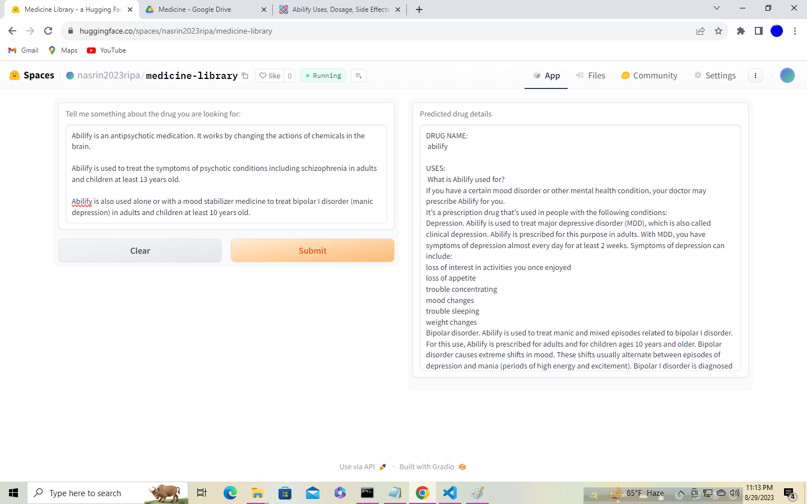
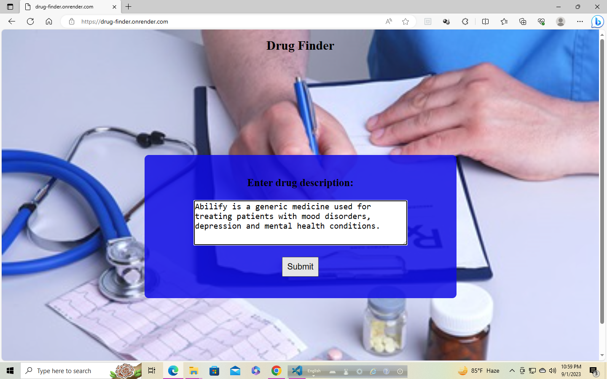
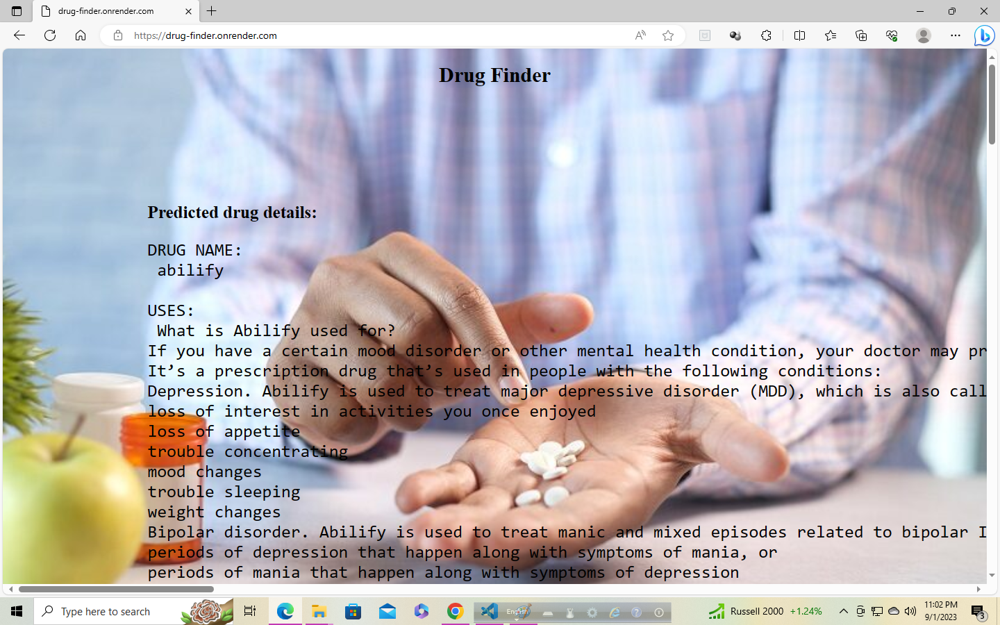

# Drug Finder 💉💊
## A Multi-Output Text Classifier Model 

## Background 
The "Drug Finder" project addresses the challenge of efficiently and accurately extracting drug details, including name, uses, dosage, and side effects, from textual drug descriptions. Currently, healthcare professionals and patients face a time-consuming and error-prone process of manually searching for this information. This project aims to develop a multioutput classifier model, utilizing logistic regression and trained on a diverse dataset, to predict drug details from natural language descriptions. The model will be deployed as an API, integrated into a user-friendly web application, and hosted on a server, facilitating easy access. By providing a reliable tool for obtaining drug information, this project seeks to improve healthcare decision-making, reduce medication errors, and enhance patient care in the pharmaceutical domain. The project's success will be assessed based on prediction accuracy, usability, and user feedback.

## Overview

The Multi-Output Text Classifier Model is an advanced machine learning solution designed for the simultaneous prediction of multiple output variables based on input text data. This versatile model is particularly valuable when tasks involve classifying a single input into multiple categories or labels. In this context, our model excels at predicting various drug-related details, such as drug names, uses, dosages, and side effects, based on input descriptions.

## How It Operates

The Multi-Output Text Classifier Model harnesses the combined power of text processing techniques and machine learning algorithms to perform its predictions. Here's an overview of its key operational steps:

1. **Data Collection:** Our primary dataset was meticulously sourced from 2 esteemed websites [Data Source 1](https://www.healthline.com) and [Data Source 2](https://www.drugs.com). The data collection process involved two pivotal stages:

    i) Drug URL Scraping: We systematically gathered drug URLs, along with their corresponding names and the files are available in the scraper folder.
    
    ii) Drug Details Scraping: Leveraging the acquired URLs, we extracted comprehensive drug descriptions, uses, dosages, and side effects. These scripts are also available in the scraper folder. The resulting data was then stored in `data\drug_dataset_big.csv`.

    In total, we amassed over 65k drug details through scraping, which, after thorough data cleaning, yielded a dataset of 45,898 drug entries, complete with detailed descriptions, uses, dosages, and side effects (with a file size of 78 MB).

2. **Data Preprocessing:** We subjected the input text data (in this case, drug descriptions) to preprocessing. This encompassed tasks such as text normalization, handling missing values, and converting the data into a suitable format for machine learning.

3. **Feature Extraction:** Text data underwent a transformation into numerical features. In our implementation, we employed the CountVectorizer technique to convert text descriptions into numerical feature vectors.

4. **Multi-Output Classification:** At the core of the model lies a powerful multi-output classifier (MultiOutputClassifier). This classifier excels at predicting multiple target variables simultaneously. We leveraged algorithms like Logistic Regression and K-Nearest Neighbors, streamlining the entire process using pipelines. You can find the model files, "drug_finder_big_knn.joblib" in the "models" folder.

5. **Prediction and Evaluation:** Once trained, the model is ready for making predictions. Given a new drug name, the model predicts uses and dosage for that particular drug. The model's predictive accuracy is assessed using appropriate metrics. Notably, the accuracy score reached 1.0. You can review the training code in the "pynotebook/drug_finder_kaggle.ipynb" file.

## Model Deployment

Accessing the compressed model is seamless through the HuggingFace Spaces Gradio App. You can find the implementation directly via this [HuggingFace Spaces Link](https://huggingface.co/spaces/nasrin2023ripa/medicine-library).

## Web Deployment

We've also developed an intuitive Flask application that allows users to input drug descriptions and receive predictions for four key outputs: drug name, uses, dosage, and side effects. The live application can be accessed via this [render Webpage](https://drug-finder.onrender.com/).

## Use Cases

The Multi-Output Text Classifier Model finds applications in a wide range of domains where a single input text needs to be classified into multiple categories or labels. Our model serves diverse use cases, including aiding doctors in researching specific medications, providing knowledge to the general public about particular drugs, and more. However, it is essential to note that this model's predictions should not replace professional medical advice. Users should exercise caution and manually verify predicted outputs, especially if there are discrepancies for a specific input description.

## How to Use

Using the Multi-Output Text Classifier Model is straightforward:

1. **Input:** Simply provide a drug description that you wish to classify. For example: "Abilify is a generic medicine used to treat mood disorders, depression, and mental health conditions."

2. **Output:** Receive predictions for drug name, uses, dosage, and side effects. An example output might include: Name: Abilify, Uses: Used to treat anxiety/depression..., Dosage: Your doctor may recommend a specific dosage..., Side effects: Side effects can range from mild to serious...

### Dependencies

To utilize this model, you'll need:

- Python 3.x
- The following libraries: pandas, scikit-learn, joblib, gradio (for user interface)

### Acknowledgments

This project was developed as the final capstone project of the Dokkho Data Science Program (cohort 2) at MasterCourse Bangladesh. Special thanks to our instructor, Mohammad Sabik Irbaz, and the entire team at MasterCourse Bangladesh for their support.

